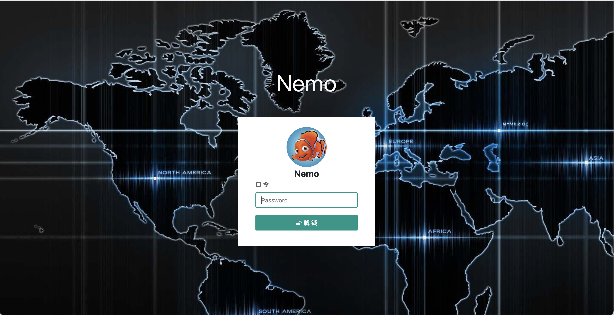
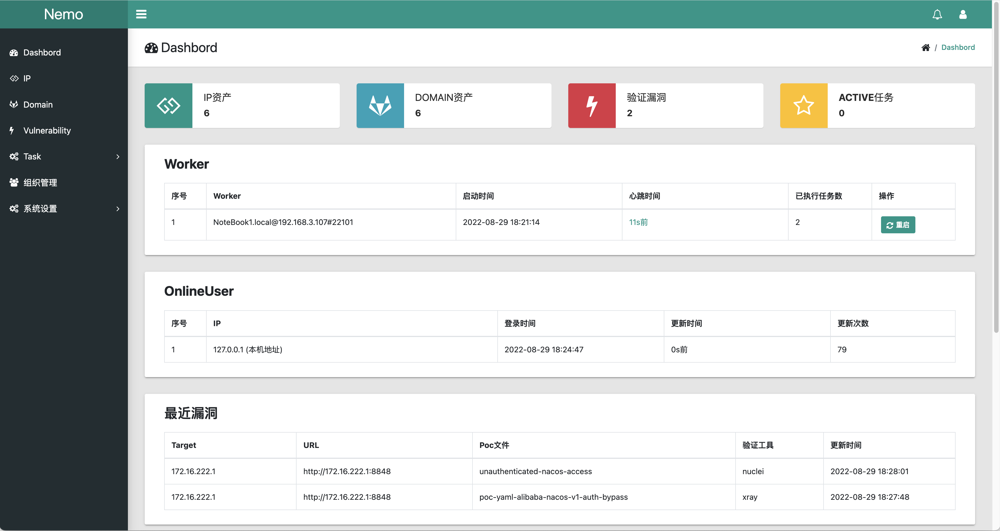
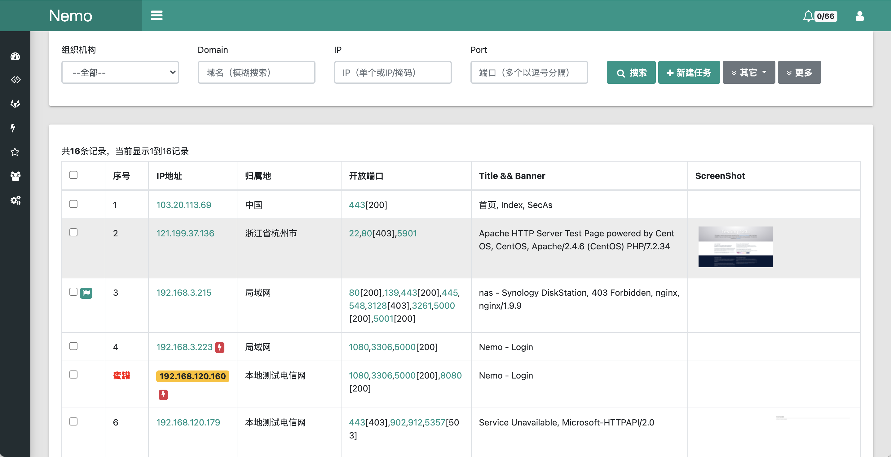
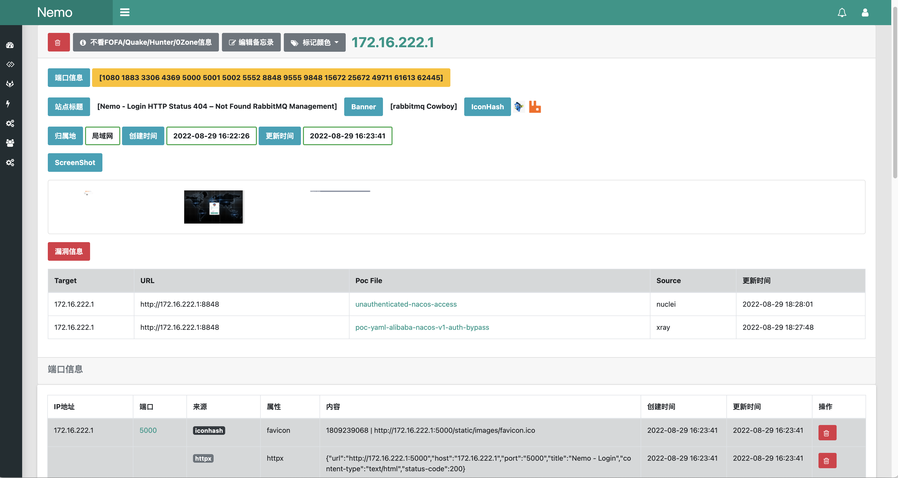
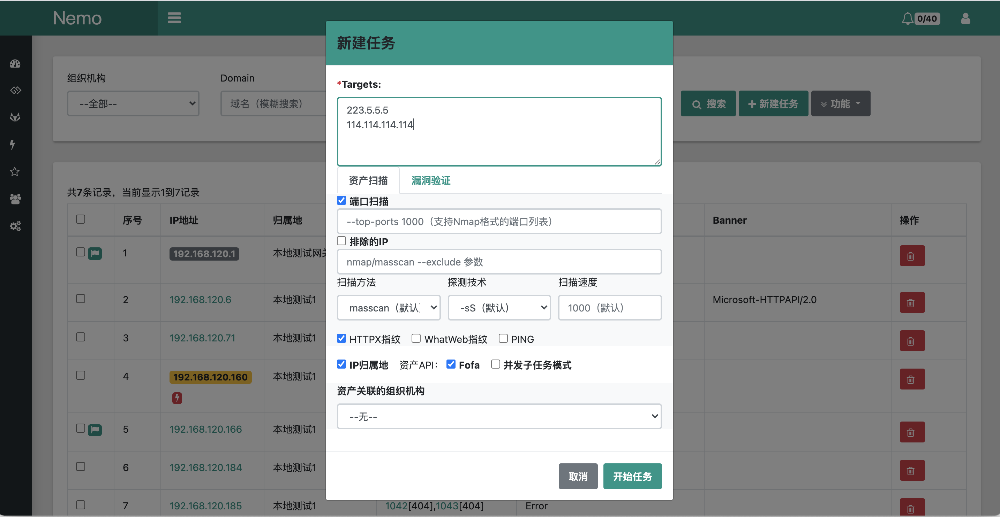
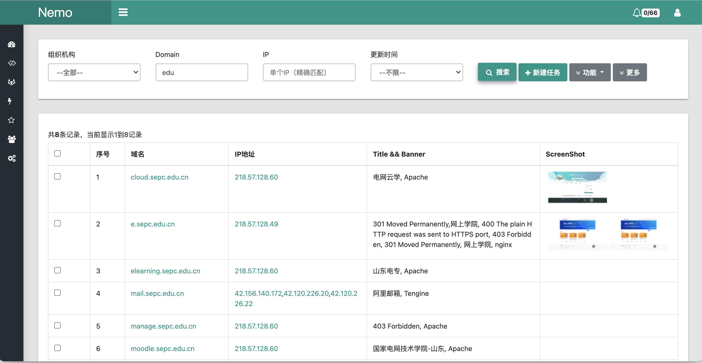
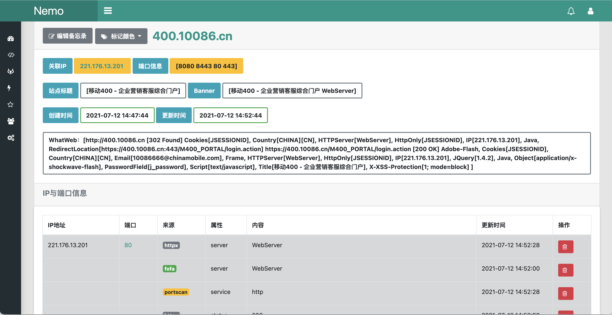
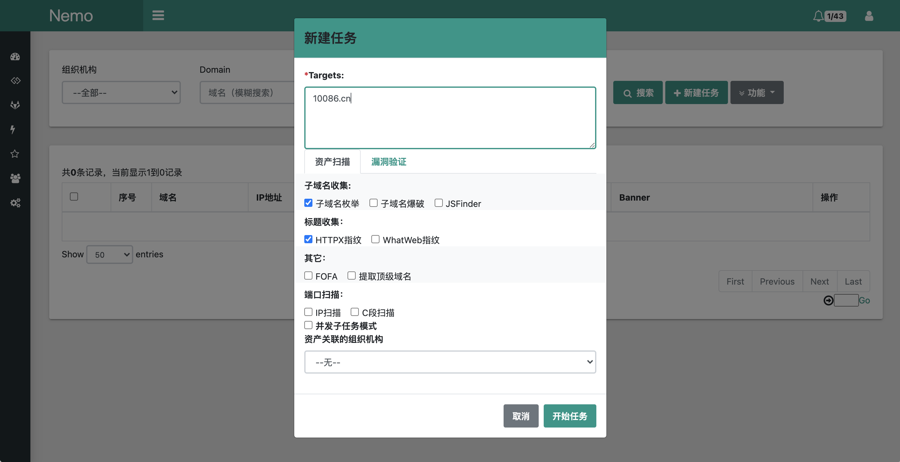
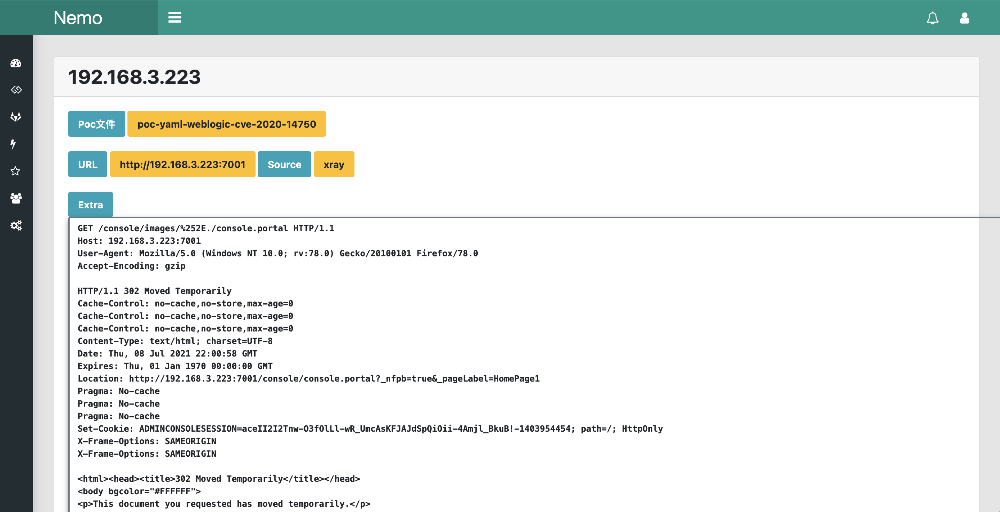
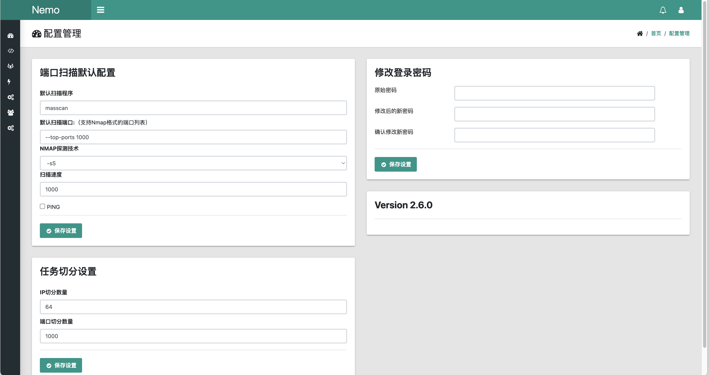

## Nemo



Nemo是用来进行自动化信息收集的一个简单平台，通过集成常用的信息收集工具和技术，实现对内网及互联网资产信息的自动收集，提高隐患排查和渗透测试的工作效率，用Golang完全重构了原Python版本。


## 已实现的功能

### 1、IP资产

- Masscan、Nmap端口扫描
- IP归属地（纯真离线数据）
- 自定义IP归属地、Service、蜜罐
- 导入本地的Masscan、Nmap端口扫描结果
- 导入[fscan](https://github.com/shadow1ng/fscan)、[Naabu]( https://github.com/projectdiscovery/naabu)、[Httpx]( https://github.com/projectdiscovery/httpx)及TXPortmap的扫描结果（适用于内网渗透的资产信息收集）
- 导入FOFA、Hunter及0Zone的查询结果导出的资产文件
- CDN识别

### 2、域名资产

- [Subfinder](https://github.com/projectdiscovery/subfinder) 子域名收集
- [Massdns](https://github.com/blechschmidt/massdns) 子域名爆破
- [Crawlergo](https://github.com/Qianlitp/crawlergo) 子域名爬虫
- [Whois](https://github.com/likexian/whois)

### 3、指纹信息

- [HTTPX](https://github.com/projectdiscovery/httpx) 
- [ScreenShot](https://github.com/chromedp/chromedp) （调用chrome headless）
- [ObserverWard](https://github.com/0x727/ObserverWard_0x727)  (指纹信息来源于https://github.com/0x727/FingerprintHub)
- IconHash（基于[mat/besticon](github.com/mat/besticon)和[Becivells/iconhash](github.com/Becivells/iconhash)项目）


### 4、API接口 （需提供相应的Key)

- [Fofa](https://fofa.info/) 
- [ICP备案信息](http://icp.chinaz.com/) 
- [Quake](https://quake.360.cn)
- [Hunter](https://hunter.qianxin.com/)

### 5、Poc验证与目录扫描

- ~~[Pocsuite3](https://github.com/knownsec/pocsuite3)  && [some_pocsuite](https://github.com/hanc00l/some_pocsuite)~~ 
- [XRay](https://github.com/chaitin/xray)
- [Nuclei](https://github.com/projectdiscovery/nuclei) && [Nuclei-Templates](https://github.com/projectdiscovery/nuclei-templates)
- [Dirsearch](https://github.com/evilsocket/dirsearch)

### 6、分布式任务

- 分布式、异步任务执行
- 多维度任务切分
- 定时任务执行
- Server与Worker通过 [RPC](https://github.com/smallnest/rpcx) 同步


### 7、团队在线协作

- [TODO]

### 8、其它

- 资产的统计、颜色标记与备忘录协作
- Docker支持

## Docker

```shell
mkdir nemo;tar xvf nemo_linux_amd64.tar -C nemo;cd nemo
docker-compose up -d
```

[更多Docker使用方式](docs/docker.md)


## Install

Tested on [ubuntu18.04/20.04 LTS](docs/install_linux.md)、[macOS](docs/install_mac.md)


## Demo

默认监听端口为5000，默认密码 **nemo** ；通过“系统设置--配置管理”更改默认密码。





















## 版本更新

- 2.5.6：2022-8-4，增加导入TXPortMap扫描的文本结果及零零信安（0.zone）导出的csv格式资产；增加资产列表查询时"不看Banner信息"的选项，可以减少无效信息的干扰；在IP资产列表显示增加不看中国大地以外地区信息的选项，以及方便ip和domain列表查询筛选一些需要删除的信息；fofa查询将cert修改为cert.subject以减少干扰信息；
- 2.5.5：2022-7-24，修复IP扫描和漏洞扫描时，读取目标资产所有开放端口时不能正确读取子网掩码目标的bug（2.5.4版本只需替换server_linux_amd64文件）。
- 2.5.4：2022-7-23，修复ObserverWard不能正确被调用的Bug（2.5.3只需要替换worker_linux_amd64即可）。
- 2.5.3：2022-7-20，增加导入Naabu和Httpx扫描结果导入到平台，以方便在内网渗透时的信息收集和协同；支持IP任务时跳过端口扫描，读取资产已探测的全部端口进行指纹和信息收集；去除效果不太用好的Wappalyzer功能；修复ObserverWard设置工作目录以正确加载指纹库，升级到2022年7月最新版本。
- 2.5.2：2022-7-14，增加域名的Whois查询。注意：由2.5.1版本升级时，需在thirdparty中增加whois目录用于存放whois查询的缓存信息。
- 2.5.1：2022-6-12，更新beego框架至v2.0.3，sessionOn属性修改至app.conf中，更新chromedp至v0.8.2；增加version.txt，记录每次更新后的版本号并在web的“系统设置”-“配置管理”中显示当前的version；导入fscan扫描结果时将结果中的poc-yaml-*漏洞加入到vulnerability中。注意：由2.5.0版本升级时，需在conf/app.conf中增加对应的sessionOn属性。
- 2.5.0：2022-5-30，新增定时任务执行；Docker的Ubuntun升级为20.04LTS、调整Docker时区；新增webfiles路径映射，统一处理server的web目录访问，取消原screenshot、taskresult与imageicon目录映射；注意：本次累积升级有较大的改动，由v2.4.21升级需导入task.sql与task_cron.sql，并修改app.conf与server.yml中staticdir字段。
- 2.4.21：2022-5-25，修复对域名进行查询时没有释放数据库连接，导致在进行大量资产查询后出现数据库连接Too many connecitons导致服务端退出的BUG ；
- 2.4.20：2022-5-24，增加mysql.cnf配置项：max_connections为1000，解决mysql在docker中经常出现连接达上限导致nemo退出；保存icon图标在本地，并在ip和domain的资产列表中进行显示（需要app.conf的staticdir中增加iconimage:/tmp/iconimage，在server.conf的web中增加iconimagePath: /tmp/iconimage，路径可以自定义）；
- 2.4.19：2022-4-29，增加[Nuclei](https://github.com/projectdiscovery/nuclei) 漏洞验证方式，默认poc使用[Nuclei-Templates](https://github.com/projectdiscovery/nuclei-templates)，worker.yml增加了相关配置选项；增加验证漏洞时读取指定IP已探测的开放端口作为目标的功能；
- 2.4.18：2022-4-27，更新httpx与subfinder，subfinder增加provider-config配置文件（thirdpary/dict/provider-config.yml，对应worker.yml配置文件增加了 providerConfig: provider-config.yml字段，可增加被动收集平台的key）；更新xray pocs、fingperprinthub指纹与observer程序；
- 2.4.17：2022-3-8，增加[Hunter](https://hunter.qianxin.com/)资产接口（在worker.yml中增加hunter的key）；
- 2.4.16：2022-2-18，修改Fofa的API接口（fofa.so->fofa.info），去除只获取前1000条的限制（获取的记录数量由API的会员等级决定）；
- 2.4.15：2022-1-25，增加[Quake](https://quake.360.cn/)资产接口（需要“会员”级别的API KEY；在worker.yml中增加quake的key）；
- 2.4.14：2022-1-12，增加Server和Worker的Docker构建文件，提高worker部署的伸缩性；
- 2.4.13：2022-1-8，增加导入fscan的扫描结果（由于只有txt方式，通过正则匹配提取IP、端口及一些重要信息，不保证百分百全部导入）；
- 2.4.12：2022-1-4，修复域名扫描同时进端口扫描时不正确创建任务导致worker退出的Bug；
- 2.4.11：2022-1-1，增加目录遍历扫描（[dirsearch](https://github.com/evilsocket/dirsearch)，建议谨慎使用）；
- 2.4.10：2021-12-31，增加子域名爬虫功能（感谢 [crawlergo](https://github.com/Qianlitp/crawlergo) 开源的代码）；
- 2.4.9：2021-12-28，增加域名和IP的CDN识别（借鉴 [github.com/timwhitez/Frog-checkCDN](https://www.github.com/timwhitez/Frog-checkCDN)）;
- 2.4.8：2021-12-13，增加根据favicon.ico获取IconHash指纹功能；
- 2.4.7：2021-12-9，增加导入本地扫描结果功能（支持nmap/masscan的XML文件），增加保存并查看任务执行结果的JSON格式的文件；优化FOFA查询后获取IP与域名的Web指纹信息；更新Xray版本为1.8.2；
- 2.4.6：2021-12-8，更新指纹识别\"侦查守卫\"的JSON结果的解析；
- 2.4.5：2021-12-7，增加调用ObserverWard获取应用系统的指纹信息，指纹信息来源于 [FingerprintHub](https://github.com/0x727/FingerprintHub)；
- 2.4.4：2021-10-18，对新建任务增加部份提示信息，便于掌握任务执行的参数；状态信息可手动刷新和查看正在执行的任务；
- 2.4.3：2021-10-13，增加IP扫描的masscan+nmap方法，masscan快速进行端口开放扫描，nmap用-sV进行详细扫描；
- 2.4.2：2021-10-9，增加IP扫描的“探测+扫描”模式任务，增加内网资产收集的便利性；去除whatweb的安装和使用（HTTPX已基本可替代其功能）；
- 2.4.1：2021-9-15，支持扫描任务按IP和端口进行多维度切分，使任务在多个worker之间均衡分布执行；
- 2.4.0：2021-9-10，使用RPC架构，优化server与worker之间的同步、server与worker的配置文件分离；增加在线的IP信息、登录验证码、按发现时间筛选资产功能。
- 2.3：2021-8-25，使用docker-compose构建Docker，修改数据库连接重试功能，完善端口扫描及任务等信息；
- 2.2：2021-8-2，增加基于Wappalyzer规则的指纹识别功能；
- 2.1：2021-7-30，用Golang完成对原python3版本的重构；


## 参考

- jeffzh3ng：https://github.com/jeffzh3ng/fuxi
- TideSec：https://github.com/TideSec/Mars