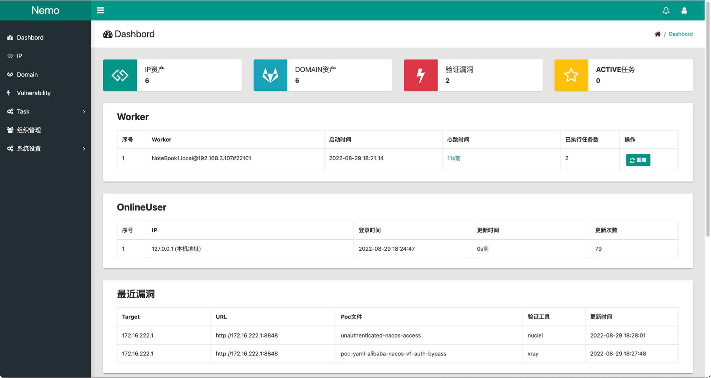

# Nemo

**[快速上手](docs/quickstart.md)** • **[安装手册](docs/install.md)** • **[使用手册](docs/usage.md)** • **[常见问题](docs/question.md)** • **[CHANGELOG](CHANGELOG.md)**

**Nemo**是用来进行自动化信息收集的一个简单平台，通过集成常用的信息收集工具和技术，实现对内网及互联网资产信息的自动收集，提高隐患排查和渗透测试的工作效率。

## 功能

### 1、IP资产

- Masscan、Nmap端口扫描
- IP归属地（纯真离线数据）
- 自定义IP归属地、Service、蜜罐
- 导入本地的Masscan、Nmap端口扫描结果
- 导入[fscan](https://github.com/shadow1ng/fscan)、[gogo](https://github.com/chainreactors/gogo)、[Httpx]( https://github.com/projectdiscovery/httpx)的扫描结果（适用于内网渗透的资产信息收集）
- 导入FOFA、Hunter及0Zone的查询结果导出的资产文件
- CDN识别

### 2、域名资产

- [Subfinder](https://github.com/projectdiscovery/subfinder) 子域名收集
- [Massdns](https://github.com/blechschmidt/massdns) 子域名爆破
- [Crawlergo](https://github.com/Qianlitp/crawlergo) 子域名爬虫
- [Whois](https://github.com/likexian/whois)

### 3、指纹信息

- [HTTPX](https://github.com/projectdiscovery/httpx) 
- [ScreenShot](https://github.com/chromedp/chromedp) （调用chrome headless）
- [ObserverWard](https://github.com/0x727/ObserverWard_0x727)  (指纹信息来源于https://github.com/0x727/FingerprintHub)
- IconHash（基于[mat/besticon](github.com/mat/besticon)和[Becivells/iconhash](github.com/Becivells/iconhash)项目）

### 4、API接口 （需提供相应的Key)

- [Fofa](https://fofa.info/)
- [Quake](https://quake.360.cn)
- [Hunter](https://hunter.qianxin.com/)
- [ICP备案信息](http://icp.chinaz.com/)

### 5、Poc验证与目录扫描

- [XRay](https://github.com/chaitin/xray)
- [Nuclei](https://github.com/projectdiscovery/nuclei) && [Nuclei-Templates](https://github.com/projectdiscovery/nuclei-templates)
- [Goby](https://gobysec.net/)（服务端部署模式）
- [Dirsearch](https://github.com/evilsocket/dirsearch)

### 6、分布式任务

- 分布式、异步任务执行与定时任务执行
- 多维度任务切分
- Server与Worker通过 [RPC](https://github.com/smallnest/rpcx)及消息队列实现通信和解耦
- Server与Worker文件自动同步
- Worker按不同类型的任务分离和组合部署
- 任务执行完成消息通知（钉钉、飞书群机器人及Server酱）

**典型VPS部署架构：**

### 7、团队在线协作

- 多用户/角色、多工作空间（项目）支持及资产隔离
- 资产颜色标记、置顶、备忘录协作
- IP/Domain黑名单、一键拉黑

### 8、其它

- Docker支持
- 资产流程化扫描（XSCAN）
- 导出IP与Domain资产

## 演示页面

## 参考

- [jeffzh3ng](https://github.com/jeffzh3ng/fuxi)
- [TideSec](https://github.com/TideSec/Mars)