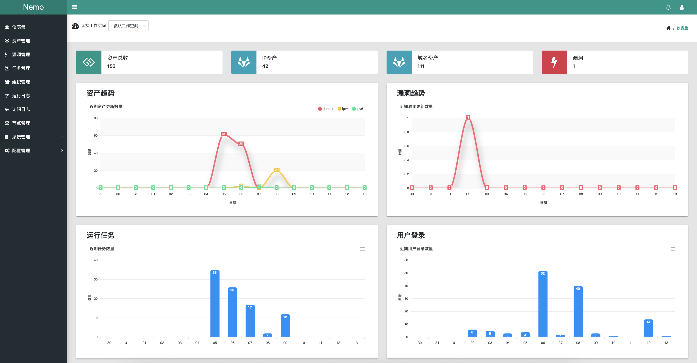
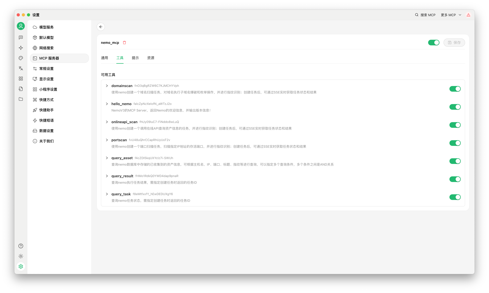
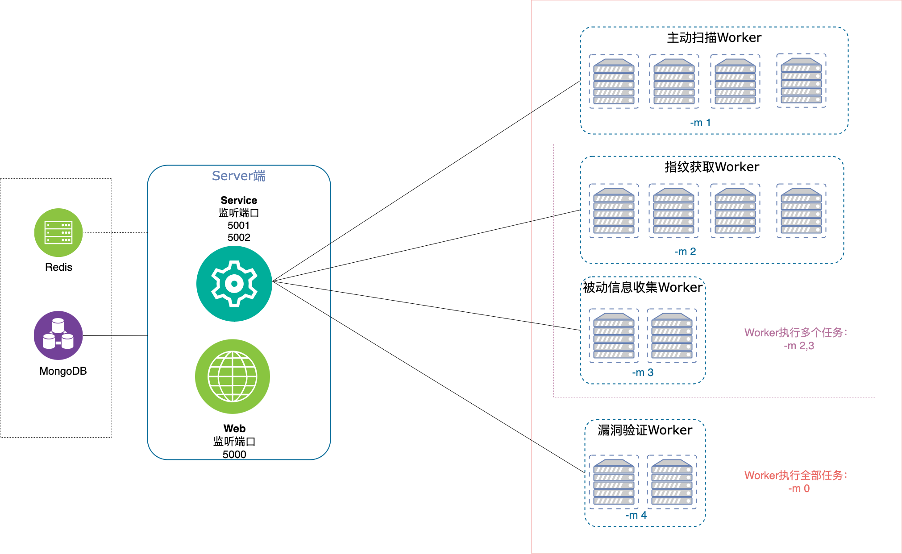

# Nemo v3

**[安装手册](v3/docs/install.md)** • **[快速使用](v3/docs/quickstart.md)** • **[MCPServer](v3/docs/mcp_server.md)** 

**Nemo**是用来进行自动化信息收集的一个简单平台，通过集成常用的信息收集工具和技术，实现对内网及互联网资产信息的自动收集，提高隐患排查和渗透测试的工作效率。

**v3 主要变化：**

- 任务架构：功能（web、service、proxy等）模块化部署，任务进行了精简，重写了任务执行流程，架构进行了优化，提升了任务执行效率；
- 任务管理：新增任务模板，通过自定义模板，创建任务的流程更加简单，任务进度、流程图可视化整个任务执行流程；
- 数据存储：使用MongoDB进行存储，存储数据更加灵活；支持保留和查询每次任务执行的历史数据；
- 资产管理：IP和域名资产统一管理，支持组合的语义查询，精简和集中了资产的管理；
- 指纹信息：HTTP指纹统一到Httpx，集成ChainReactor的HTTP指纹识别库；
- Poc验证：只保留Nuclei方式的Poc验证（后续将优化基本于指纹和Poc的联动验证）；
- LLMAPI接口：新增通过Kimi、Qwen、Deepseek等LLMAPI接口去获取企业域名信息（有一定的幻觉）；
- 企业备案信息：新增通过ChinaZ接口获取企业备案信息（高可靠性），实现给定企业名称实现自动化的信息收集；
- 新增Standalone模式：支持单文件worker部署，无需依赖其他组件，适合实战中内网渗透的快速信息收集与Nemo的集成（后续在优化后开源）；
- 新增MCP Server，为AI模型与外部数据源或工具提供交互接口；

## 特性

### 1、资产收集

- IP资产与端口扫描：Masscan、Nmap、[gogo](https://github.com/chainreactors/gogo)（支持代理的端口扫描器）
- 域名收集：- [Subfinder](https://github.com/projectdiscovery/subfinder) (子域名收集)、[Massdns](https://github.com/blechschmidt/massdns) （子域名爆破）、[Whois](https://github.com/likexian/whois)
- IP归属地（纯真离线数据）
- 自定义IP归属地、蜜罐
- CDN识别
- IPV6资产 [使用了解](docs/question.md#10ipv6资产)

### 2、指纹信息

- [HTTPX](https://github.com/projectdiscovery/httpx) 获取HTTP指纹、Web截图、IconHash指纹等
- [ChainReactor](https://github.com/chainreactors/fingers) 、[FingerprintHub](https://github.com/0x727/FingerprintHub) HTTP被动指纹识别
- [fingerprintx](https://github.com/praetorian-inc/fingerprintx)获取非HTTP协议指纹

### 3、API接口 （需提供相应的Key)

- [Fofa](https://fofa.info/)
- [Quake](https://quake.360.cn)
- [Hunter](https://hunter.qianxin.com/)
- [ICP备案信息](http://icp.chinaz.com/)
- [企业备案信息](https://www.chinaz.net/mall/a_POGZL6l6KS.html)

### 4、LLMAPI接口获取企业域名信息（需提供相应的Token)

- [Kimi](https://kimi.moonshot.cn/)
- [Qwen](https://tongyi.aliyun.com/)
- [Deepseek](https://www.deepseek.com/)

### 5、Poc验证与目录扫描

- [Nuclei](https://github.com/projectdiscovery/nuclei) && [Nuclei-Templates](https://github.com/projectdiscovery/nuclei-templates)
- [some_nuclei_templates](https://github.com/hanc00l/some_nuclei_templates)
- 指纹与Poc关联库：[poc_map](https://github.com/hanc00l/poc_map)

### 6、分布式任务

- 分布式、异步任务执行与定时任务执行
- 支持IP任务切分
- Server与Worker通过 [RPC](https://github.com/smallnest/rpcx)及消息队列实现通信和解耦
- Worker运行资源按需动态请求
- Worker按不同类型的任务分离和组合部署
- 任务执行完成消息通知（钉钉、飞书群机器人及Server酱）

    **典型VPS部署架构：**

### 7、团队在线协作

- 多用户/角色、多工作空间（项目）支持及资产隔离
- 资产备忘录协作
- IP/Domain黑名单、一键拉黑

### 8、TODO
- [X] 指纹信息优化（支持更多指纹识别方式）
- [X] Poc验证优化（支持更多Poc验证方式、前端批量管理Poc）
- [X] 指纹 + Poc 联动验证
- [ ] Standalone模式优化后开源
- [ ] 资产管理优化（支持更多资产类型、资产搜索、资产导入导出）
- [ ] 十万级分布式节点统一管理（支持节点管理、任务动态伸缩等）
- [ ] ElasticSearch亿级海量数据检索（支持全文搜索、数据分析）
- [ ] 大模型本地/API技术，提升信息收集效率和准确性
- [ ] 前端重构（Vue，计划2026年V4.0版本）

## 致谢

感谢以下开源项目/作者的贡献（排名不分先后）：

- [Machinery](https://github.com/RichardKnop/machinery)
- [RPC](https://github.com/smallnest/rpcx)
- [Beego](https://github.com/beego/beego)
- [Whois](https://github.com/likexian/whois)
- [ChainReactor](https://github.com/chainreactors)
- [Fingerprintx](https://github.com/praetorian-inc/fingerprintx)
- [ProjectDiscovery](https://github.com/projectdiscovery)
- [Nali](https://github.com/hahwul/nali)
- [Cron](https://github.com/robfig/cron)
- [FingerprintHub](https://github.com/0x727/FingerprintHub)
