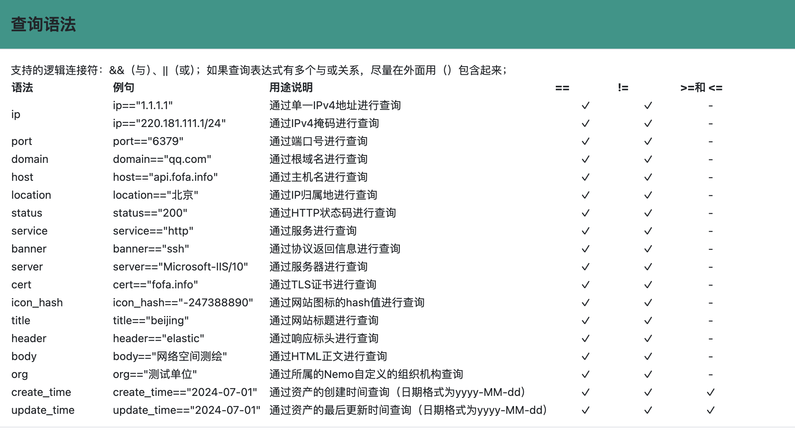

# Nemo常见问题

##v1.3

2024-1-3

### 1、Docker安装后无法使用

请从github的Release下载最新的nemo_linux_amd64.tar；clone或下载的源码，不包括编译后的可执行二进制文件及thirdparty中的第三方二进制程序。

### 2、Docker安装后看不到worker

由于Server与worker的文件同步机制，worker在每次启动时会自动与Server进行文件同步，server同时会监控Server目录下的文件更改并自动发起同步。worker的配置文件conf/worker.yml如果与server目录下的不一致从而导致worker的配置文件被同步覆盖，从而导致worker不能正常与server进行通信。
因此在构建docker前（特别是worker是分布式部署情况下），请确保Server与worker的conf/yml配置文件已正确配置后再进行构建。

### 3、Subfinder增加对第三方API的Key的支持

Nemo集成的subfinder只支持不需要第三方Key的平台的API接口。
如果需要更全面地收集子域名信息，建议申请和配置第三方的API接口的Key，配置文件位于thirdpary/dict/provider-config.yml，具体配置方法请参考[subfinder](https://github.com/projectdiscovery/subfinder)。

### 4、能否支持资产的导出

v2.10后，Nemo新增导出功能，根据当前列表视图的搜索条件，将IP或Domain资产导出为csv格式文件；同时提供统计功能，结合导出和统计方便进一步开展渗透测试。

### 5、能否支持Arm平台

目前Nemo支持和测试的平台包括x86-amd64平台的Linux、Macos和Windows。理论上golang支持向更多平台的移植，但依赖的其它工具也需要同步集成到thirdparty目录下，Nemo在调用时会按照运行的平台自动选择匹配的文件，文件的命名格式可参考pkg/utils/fileutil.go：
```golang
// GetThirdpartyBinNameByPlatform 根据当前运行平台及架构，生成指定的文件名称
func GetThirdpartyBinNameByPlatform(binShortName BinShortName) (binPlatformName string) {
	binPlatformName = fmt.Sprintf("%s_%s_%s", binShortName, runtime.GOOS, runtime.GOARCH)
	if runtime.GOOS == "windows" {
		binPlatformName += ".exe"
	}
	/*
		https://go.dev/doc/install/source#environment
			$GOOS	$GOARCH
			android   arm
			darwin    386
			darwin    amd64
			darwin    arm
			darwin    arm64
			dragonfly amd64
			freebsd   386
			freebsd   amd64
			freebsd   arm
			linux     386
			linux     amd64
			linux     arm
			linux     arm64
			linux     ppc64
			linux     ppc64le
			linux     mips
			linux     mipsle
			linux     mips64
			linux     mips64le
			netbsd    386
			netbsd    amd64
			netbsd    arm
			openbsd   386
			openbsd   amd64
			openbsd   arm
			plan9     386
			plan9     amd64
			solaris   amd64
			windows   386
			windows   amd64
	*/
	return
}
```

如果有其它平台的需求，可以参考进行移植。

### 6、能支持其它漏洞扫描工具吗

Nemo更多的聚焦在资产信息的收集工具和手段，以及为下一步渗透测试、实战攻防作好参考。漏洞的扫描和利用，只是集成专业了相关工具，并且也只是作为资产的一个辅助。目前的代码主要还是满足个人及同事在实际工作中最主要的需求来写的，因能力、精力和时间有限，我们也知道可能无法满足所有人的功能需求。

从实战的角度来讲，漏洞类的扫描（比如dirsearch、Nuclei的POC等），因为具有比较显示的攻击流量特征，在有流量及安全设备的情况下，极容易触发封IP条件，从而导致worker无法进一步的对目标进行资产收集。在具有授权白名单或内网中，使用漏洞扫描工具是具有可行性的。因此基于实战考虑，漏洞扫描请大家在使用时根据情况慎重使用。

### 7、重启server后，用户名密码正确有时无法正确登录

为了提高安全性，Nemo在登录时使用了RSA加密用户名和密码，并且在每次server启动时会重新生成公钥和私钥对，公钥写入login.js文件，私钥保存在内存中。

在确保用户名、密码及验证正确的情况下，如果无法登录到Nemo，原因是由于浏览器缓存的存在导致js文件中的私钥没有更新。可手工清除浏览器的缓存文件即可。

### 8、在VPS上后台运行的server与worker的推荐方式

```bash
#在命令行下运行：
screen ./server_linux_amd64
#或者
screen ./daemon_worker_linux_amd64

#server或worker的进程不会因为关掉终端而被kill，通过执行命令可以恢复到命令行
screen -r

#如果没有screen命令，可以通过apt install screen安装；详细使用方式请网上搜索参考文档。
```

### 9、Worker使用Socks5代理

从v2.11开始，支持worker部份功能使用代理扫描，使用方法可参考[安装说明](install.md)中的详细步骤。

### 10、IPV6资产

从v2.10.2开始，Nemo支持对IPv6资产的信息收集。在使用IPv6之前，你必须对IPv6有一些基础了解，比如：

- IPv6 地址的长度为 128 位，由八个 16 位字段组成，相邻字段用冒号分隔。IPv6 地址中的每个字段都是用十六进制数字表示。比如2001:0db8:3c4d:0015:0000:0000:1a2f:1a2b，前48位2001:0db8:3c4d包含表示公共拓扑的站点前缀，随后的16位0015包含代表站点专用拓扑的子网 ID，低阶（最右边的 64 位）0000:0000:1a2f:1a2b包含接口ID。
- 为了简化其表示法，rfc2373提出每段中前面的0可以省略，连续的0可省略为"::"，但只能出现一次。例如：1080:0:0:0:8:800:200C:417A可以简化为1080::8:800:200C:417A。
- 访问IPv6地址的URL格式为：http://[2001:db8:0:1]:80/index.html，必须使用方括号将IPv6地址括起来。
- Nmap在扫描IPv6地址时，需要在地址前加上前缀，比如：nmap -6 2001:db8:0:1::/64；如果不加前缀，nmap会自动将地址转换为IPv4地址进行扫描。massscan可自动识别并同时对ipv4/ipv6进行扫描。
- 由于IPv6地址的长度，导致在扫描时，扫描速度会比IPv4慢很多，因此建议在扫描时，将IPv6地址单独扫描，或者将扫描的端口范围缩小， 同时Nemo默认会丢弃掩码低于/104的IPv6地址，因此建议在扫描时，将掩码设置为/104以上。
- Nemo对域名任务，会自动识别域名对应的IPv6地址。对于IP任务，如果需要扫描IPv6地址，需要在IP任务中添加IPv6地址，或者在IP任务中添加域名，Nemo会自动识别域名对应的IPv6地址。
- 最最最重要的一点：Worker必须支持IPv6地址，否则无法正常工作。请用ifconfig/ipconfig查看ip时，确认启用了ipv6并且地址并且不是fe80开头（fe80::/10为本地链路地址，用于单一链路，适用于自动配置、邻机发现等，路由器不转发，类似ipv4的169.254/地址）。

### 11、ElasticSearch功能（测试中）

从v2.13.1开始，增加了数据同步到ElasticSearch的功能。

- ElasticSearch服务需单独安装；将URL及用户密码，在server.yml中进行配置(以下为配置样例，请根据实际修改)

```yaml
elastic:
  url: https://127.0.0.1:9200
  username: elastic
  password: xxxxxxx
```
- 编译cmd/estools/main.go，生成estools可执行文件，放到server目录下。
- 启动server后，将server中的数据同步到ElasticSearch中。命令参数-i -w为要同步的workspace的GUID

```shell
  -c	create index
  -d	delete index
  -f string
    	import by json file path
  -i	import data to es
  -w string
    	import index name by workspace guid
Usage:
	estools -i -w workspace_guid		import data from nemo database to elasticsearch
	estools -c -w workspace_guid		create index
	estools -d -w workspace_guid		delete index
	estools -i -w workspace_guid -f json_file_path		import data from json file to elasticsearch
```

- Nemo的任务执行结果会自动同步到ElasticSearch中。
- 在EsSearch页面，可通过语法查询ElasticSearch中的数据，支持的语法请参考：
  