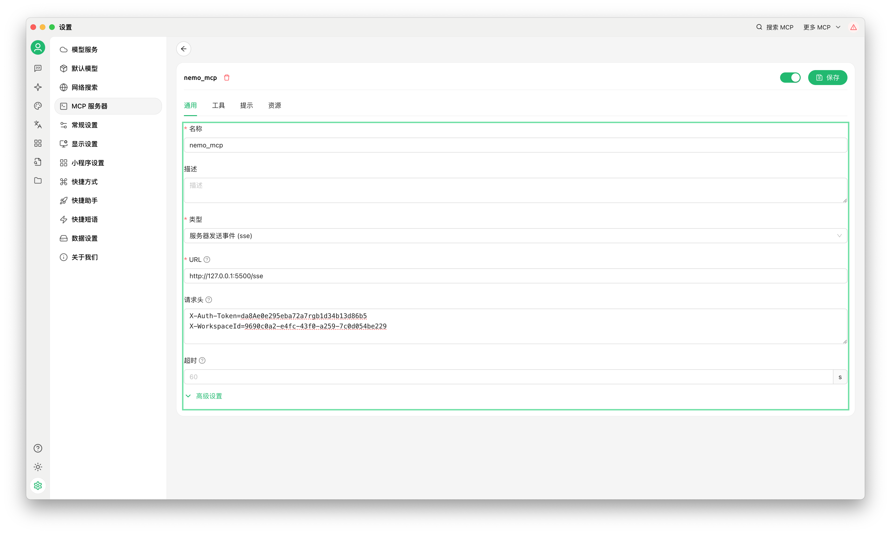
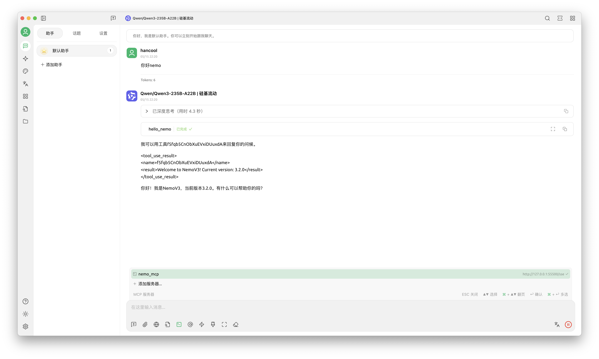

# MCP Server API

## Nemo配置与启动

- 在conf/server.yml中，配置MCP Server监听的地址、端口、SSL证书等信息。 同时配置相关认证信息，包括token及对应的工作空间；其中workspaceId可在Nemo管理页面的“工作空间”管理里查看。
- 建议正式环境使用时修改对应的token。

```yaml
mcpServer:
  host: 0.0.0.0
  port: 5500
  tlsEnable: false
  tlsCert:
  tlsKey:
  authToken:
    - token: da8Ae0e295eba72a7rgb1d34b13d86b5
      description: Token for nemo user
      workspaceId:
        - 9690c0a2-e4fc-43f0-a259-7c0d054be229
```
-   启动MCP Server，在server增加启动参数--mcp：

```shell
$  ./server_darwin_amd64 -h
Usage:
  server_darwin_amd64 [OPTIONS]

Application Options:
      --web            web service
      --cron           cron service
      --service        rpc service
      --redis-tunnel   redis tunnel service
      --mcp            mcp server service

web-option:
      --tls_cert_file= TLS certificate file (default: server.crt)
      --tls_key_file=  TLS key file (default: server.key)

Help Options:
  -h, --help           Show this help message
```

## 在Cherry Studio配置使用

- 在Cherry Studio的“设置”-“MCP 服务器”页面，配置MCP Server的地址、端口、SSL证书等信息；类型为SSE，URL格式为：http://ip:5500/sse。
- 在请求头中添加认证信息（与配置server.yml中保持一致）：

```http request
X-Auth-Token=da8Ae0e295eba72a7rgb1d34b13d86b5
X-WorkspaceId=9690c0a2-e4fc-43f0-a259-7c0d054be229
```


- 保存配置后，在“工具”里可以查看到MCP Server的相关信息。


- 在cherry studio的会话中，选择支持MCP的大模型，并选择配置的 MCP Server，即可使用大模型的MCP功能。


